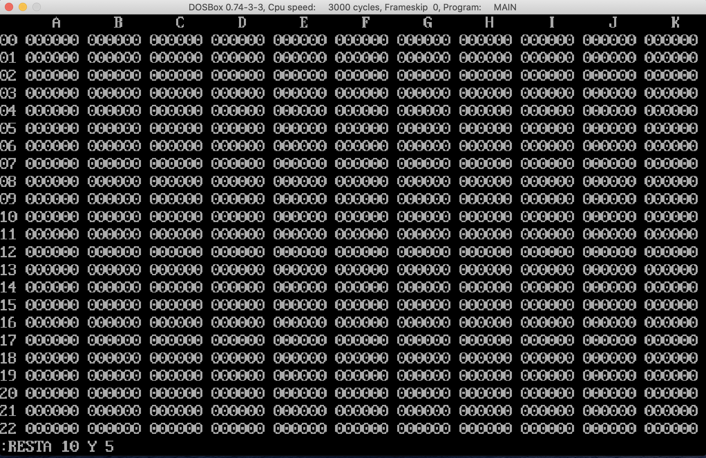
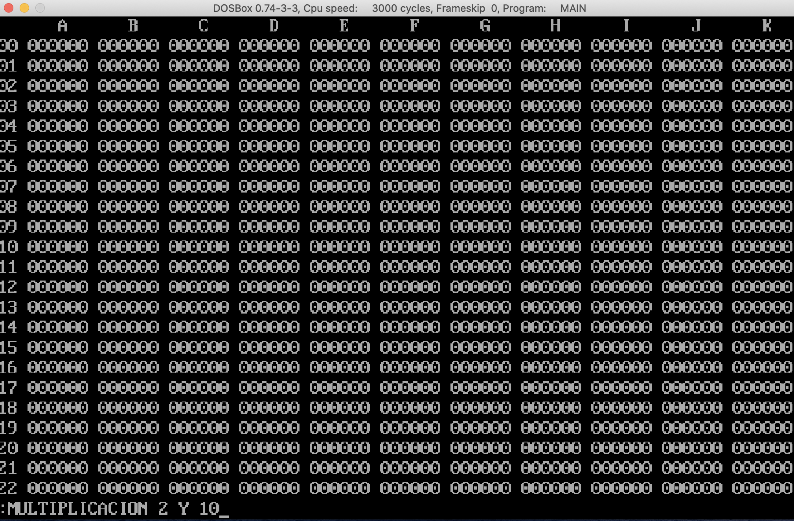

# Práctica 4

## Universidad de San Carlos de Guatemala
## Facultad de Ingeniería
## Escuela de Ciencias y Sistemas
## Arquitectura de Computadores y Ensambladores 1
## Sección B

## Descripción
El programa consiste en un sistema hojas de cálculo, que permite realizar operaciones básicas de hojas de cálculo, como sumar, restar, multiplicar, dividir, etc. Además, permite guardar y cargar hojas de cálculo.

## Requerimientos
Para poder jugar a este juego, es necesario tener instalado un emulador de entorno de sistema operativo DOS (Disk Operating System), como por ejemplo [DOSBox](https://www.dosbox.com/). Además, es necesario tener instalado el compilador de lenguaje ensamblador x86, [MASM](https://www.masm32.com/).

## Instalación
Para poder jugar a este juego, es necesario ejecutar el archivo .EXE llamado `main.exe`que se encuentra en la raíz del proyecto. Para ello, es necesario abrir el emulador de DOSBox y ejecutar el comando `main.exe`.
```bash
main.exe
```

## Uso
Una vez ejecutado el programa, se mostrará una introducción del creador del programa. Dentro del programa al realizar operaciones distintas a `GUARDAR`, el valor se guardará en el valor de retorno


A continuación se mostrará el tablero, y se le pedirá al usuario qué comando desea ejecutar. Para ello, se le pedirá que ingrese el comando en la consola, y presione la tecla `Enter`.


## Comandos


### GUARDAR: GUARDAR [Número o celda] EN [Celda]
Con este comando es posible colocar un valor arbitario en una celda. No se modifica el retorno.


### SUMA:  SUMA [Número o celda] Y [Número o celda]
Esta operación ejecutará una suma y el resultado de ésta será colocado en la variable de retorno.


### RESTA:  RESTA [Número o celda] Y [Número o celda]
Esta operación ejecutará una resta y el resultado de ésta será colocado en la variable de retorno. Si la resta se desborda, se mostrará un mensaje de advertencia.



### MULTIPLICACION: MULTIPLICACION [Número o celda] Y[Número o celda]
Se ejecutará una multiplicación de cantidades de 16 bits. El resultado será colocado en la variable de retorno. Si la operación llegara a generar un número que no puede ser representado con 5 digítos decimales, se mostrará una advertencia.



### DIVIDIR: DIVIDIR [Número o celda] ENTRE [Número o celda]
El comando ejecutará una división, la parte entera del resultado será colocada en la variable de retorno. No pueden existir las divisiones entre cero, por lo que se mostrará un mensaje


### POTENCIAR: POTENCIAR [Número o celda] A LA [Número o celda]
Esta operación permitirá ejecutar una potencia tomando como base el primer número y el número restante como exponente. El resultado no puede ser mayor a 5 dígitos, solo podrán ser exponentes posivitos. El resultado de la operación se colocará en el retorno.


### OLÓGICO: OLÓGICO [Número o celda] Y [Número o celda]
Este comando ejecutará un OR a nivel de bits con las cantidades brindadas como parámetros. El resultado de esta operación se colocará en el retorno.


### YLÓGICO: YLÓGICO [Número o celda] Y [Número o celda]
Este comando ejecutará un AND a nivel de bits con las cantidades brindadas como parámetros. El resultado de esta operación se colocará en el retorno.

 

### OXLÓGICO: OXLÓGICO [Número o celda] Y [Número o celda]
Este comando ejecutará un XOR a nivel de bits con las cantidades brindadas como parámetros. El resultado de esta operación se colocará en el retorno.


### NOLÓGICO: NOLÓGICO [Número o celda]
Este comando ejecutará un NOT a nivel de bits con las cantidad brindada como parámetro. El resultado de esta operación se colocará en el retorno.


### IMPORTAR: IMPORTAR [Nombre de archivo] SEPARADOR POR TABULADOR

El programa solicitará en qué columna se deben guardar los valores de las celdas, separadas por tabuladores. Los datos se empiezan a insertar desde la fila 0. Es necesario incluir nombre a los encabezados de cada columna


### Errores
Si se ingresa mal un comando, como por ejemplo, faltan argumentos en la función, se mostrará un mensaje de error.

